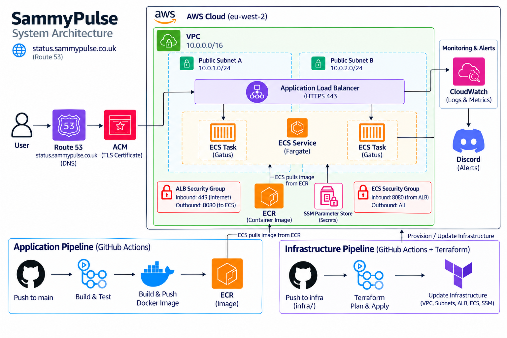

# SammyPulse ECS

SammyPulse is a monitoring application deployed on AWS ECS Fargate. It uses Gatus to check whether services are available and healthy.

The deployment uses Docker, AWS, Terraform, HTTPS, monitoring and automated application deployments through GitHub Actions.

## Tech Stack

  

**AWS:** ECS Fargate · ECR · ALB · Route 53 · ACM · CloudWatch · SSM · IAM

## Architecture

