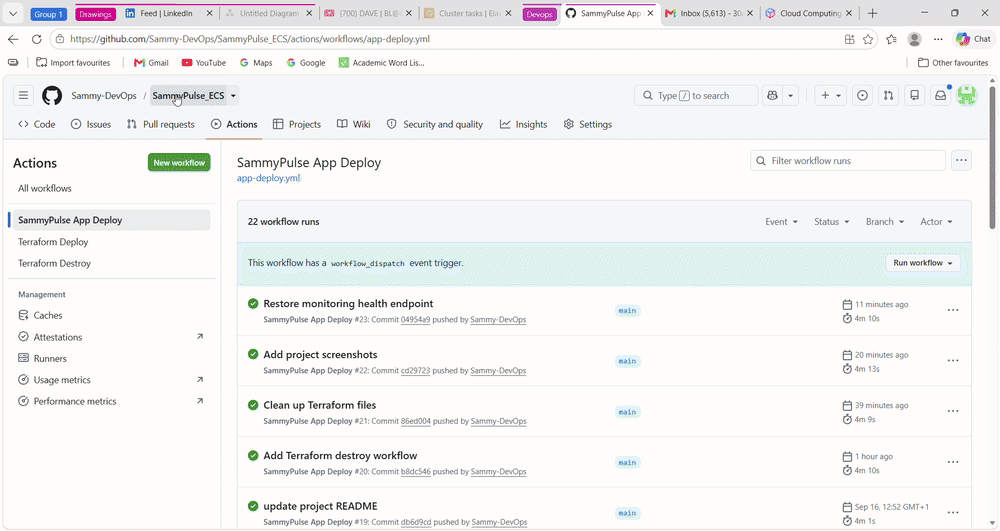
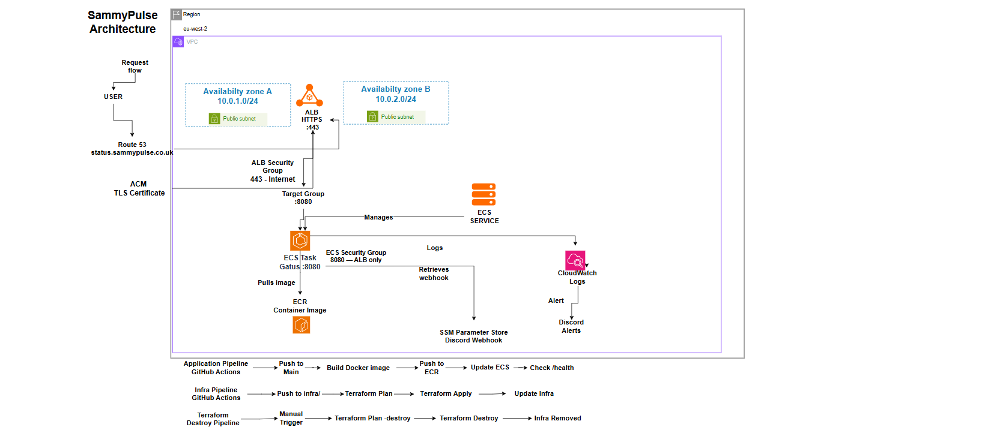
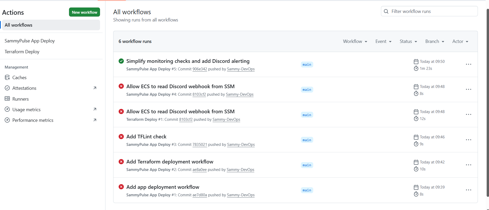
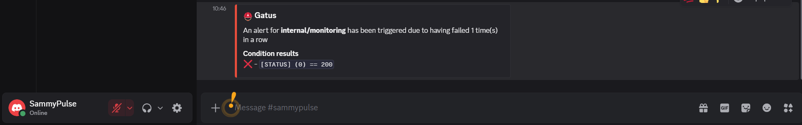
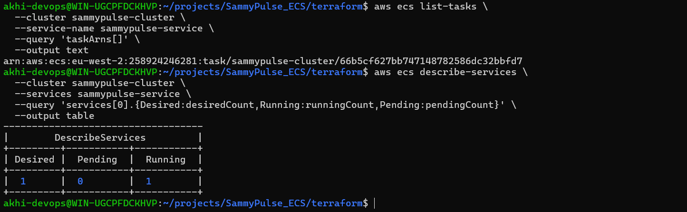
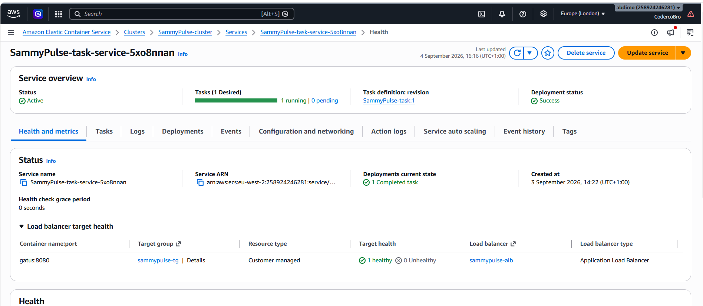

# SammyPulse ECS

SammyPulse is my deployment of Gatus, an open-source app that monitors endpoints and reports when something goes down. I containerised it with Docker, deployed it on AWS ECS Fargate and used Terraform and GitHub Actions to manage the infrastructure and deployments.

The aim was to keep the platform small enough to understand end to end, while still making decisions around security, reliability, cost and recovery.

## Live Demo

🌐 **[View SammyPulse](https://status.sammypulse.co.uk)**



## Architecture



**User → Route 53 → HTTPS/ALB → ECS Fargate → SammyPulse**

I decided the ALB should be where the public internet stops. Route 53 sends users to the ALB over HTTPS, then the ALB forwards traffic to SammyPulse on `8080`. The ECS security group only allows that port from the ALB security group, so the task isn't directly open to inbound internet traffic.

## Run Locally

```bash
git clone https://github.com/Sammy-DevOps/SammyPulse_ECS.git
cd SammyPulse_ECS

docker build -t sammypulse:local ./app
docker run --rm -d --name sammypulse -p 8080:8080 sammypulse:local

curl http://localhost:8080/health
# {"status":"UP"}
```

## Building SammyPulse

### From Docker to AWS

I started with the application running locally in Docker, then pushed the image to ECR and deployed it to Fargate. I chose Fargate because I wanted to focus on the container and AWS services rather than managing EC2 hosts. The trade-off is less control over the underlying compute, which was fine for this deployment.

I also had a cost constraint. SammyPulse runs one task across two public subnets with no NAT gateway. This keeps the AWS footprint smaller, but the task needs a public IP for outbound access and there is no second healthy target while ECS replaces it. Inbound traffic is still restricted to the ALB through the security groups.

### Moving to Terraform

The infrastructure started manually because I wanted to understand how each part connected before automating it. Once the request path was working, I moved the network, ALB, ECR and ECS resources into Terraform modules.

The infrastructure already existed, so moving it into modules changed the Terraform addresses. I didn't want a code restructure to recreate working resources, so I used `moved` blocks to map the old addresses to the new ones.

Terraform state is stored in S3 so local Terraform and GitHub Actions share the same state. At one point CI planned around 20 resources that already existed while my local plan showed no changes. I wasn't touching apply with a plan like that. I traced it back to the backend setup, fixed it and checked the plan again.

### Automating Deployments

Once the infrastructure was stable, I automated deployments with GitHub Actions. Application changes build an image, tag it with the Git SHA, push it to ECR and update ECS. The SHA means I can trace a deployed image back to the commit that produced it.

GitHub authenticates to AWS through OIDC instead of storing long-lived AWS keys. Infrastructure changes have their own Terraform workflow, while destroy is a separate manual workflow so removing the environment has to be intentional.



## Testing Failure

I didn't want the project to stop at a successful deployment, so I tested what happened when things actually broke.

I deliberately failed one of the monitored endpoints. SammyPulse detected it and sent a Discord alert, then sent a recovery notification when the endpoint came back. The webhook is stored in SSM Parameter Store rather than the repository, and application logs go to CloudWatch.



I also stopped the running ECS task. Because the service desired count was one, ECS detected the missing task and launched a replacement.



One of the main problems I hit during the build was an ECS task that was running while the ALB still showed the target as unhealthy. I followed the request path from the ALB to the target group and then the ECS security group. The ALB couldn't reach the task on `8080`. I fixed the rule by allowing `8080` from the ALB security group only, and the target became healthy.



I tested a bad deployment as well. When the new version couldn't become healthy, I checked the ECS deployment and CloudWatch logs, rolled back to the last known good image and checked `/health` again to confirm recovery.

## What I'd Improve

The current design favours cost and simplicity over maximum availability. The next step would be private subnets for the ECS tasks so they no longer need public IPs, using VPC endpoints for AWS services and NAT only where outbound internet access is required.

I'd also move from one task to multiple tasks across availability zones. That would cost more, but the ALB would have another healthy target during a task failure or deployment.

Finally, I'd add automatic rollback for failed deployments and CloudWatch alarms around ALB errors, response time and ECS CPU and memory. That would move some of the recovery and detection I'm currently doing manually into the platform itself.

## Application Credit

[Gatus](https://github.com/TwiN/gatus) was created by TwiN. My work covers the Docker deployment, AWS infrastructure, Terraform, CI/CD, security, monitoring, failure testing and troubleshooting around the application.
